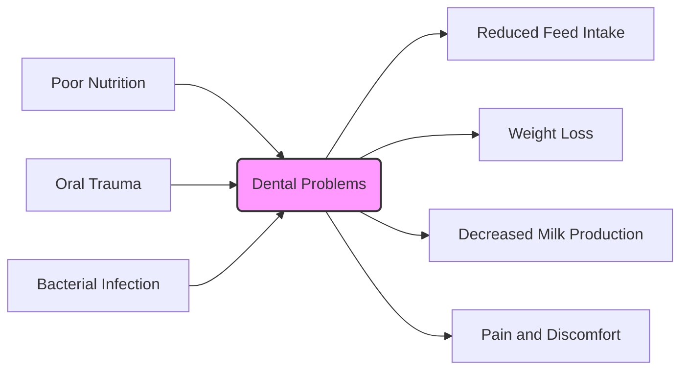

# Cows

Cows, also known as cattle, are domesticated ungulates belonging to the *Bovidae* family and the *Bos* genus.  They are a vital part of agriculture worldwide, providing us with milk, meat (beef and veal), leather, and other products. Understanding their biology, behavior, and role in human society is essential for anyone involved in agriculture, food production, or simply interested in the world around them.


```masteryls
{"id":"69050fe2-9e9a-45f4-9f79-8361e6b6cbde", "title":"Latin Name for Cows", "type":"multiple-choice", "body":"What is the scientific (Latin) name for domestic cattle (cows)?" }
- [ ] *Bos taurus indicus*
- [ ] *Sus scrofa domesticus*
- [x] *Bos taurus*
- [ ] *Ovis aries*
```


| Header 1 | Header 2 | Header 3 |
|----------|----------|----------|
| Row 1 Col 1 | Row 1 Col 2 | Row 1 Col 3 |
| Row 2 Col 1 | Row 2 Col 2 | Row 2 Col 3 |


### Bovine Dental Hygiene

Maintaining good dental hygiene in cattle is crucial for their overall health, productivity, and longevity. Unlike humans who brush their teeth daily, cows rely on their natural grazing behavior and saliva production to keep their teeth relatively clean. However, certain factors can compromise their dental health, leading to various issues.

**Anatomy Recap:** Remember that cows have a unique dental structure. They lack upper incisors, instead possessing a dental pad. Their lower incisors work in conjunction with this pad to tear off vegetation. They also have premolars and molars used for grinding food. Because of this unique anatomy, dental issues manifest differently than in humans.

**Common Dental Problems:**

*   **Periodontal Disease:** This is an inflammation of the gums and supporting structures of the teeth. It can be caused by feed impaction, bacterial infections, and poor nutrition. Symptoms include receding gums, loose teeth, and bad breath.
*   **Tooth Abscesses:** Infections around the tooth root can lead to abscesses, causing pain, swelling, and difficulty eating. These are often caused by injuries to the mouth or teeth.
*   **Broken Teeth:** Cows can break their teeth by chewing on hard objects or through trauma. Broken teeth can cause pain, difficulty chewing, and increase the risk of infection.
*   **Lumpy Jaw (Actinomycosis):** This is a bacterial infection that causes bony swellings in the jaw. It is often caused by oral injuries that allow bacteria to enter the bone.

**Prevention and Management:**

While daily brushing isn't feasible, several strategies can promote good dental hygiene in cattle:

*   **Proper Nutrition:** A balanced diet with adequate calcium and phosphorus is essential for strong teeth and healthy gums. Avoid feeding excessive amounts of acidic feeds, which can erode enamel. Ensure adequate roughage, as this encourages saliva production, which helps clean the teeth.
*   **Regular Dental Exams:** Veterinarians can perform routine dental exams to identify and address potential problems early. This is especially important for older cows.
*   **Minimize Oral Trauma:** Remove rocks and other hard objects from pastures to prevent injuries to the mouth and teeth. Be mindful of feeding equipment that could potentially cause trauma.
*   **Treatment of Dental Problems:** Prompt veterinary treatment is essential for dental problems. This may involve antibiotics for infections, tooth extractions, or other procedures.

**Example:** Consider a dairy farm with a herd experiencing decreased milk production. After ruling out other common causes, a veterinarian performs dental exams and discovers that several cows have severe periodontal disease, affecting their ability to properly chew their feed and absorb nutrients. Treatment involves antibiotics, dental cleaning, and adjustments to the feeding regimen to include softer feeds. This highlights the impact of dental health on overall productivity.

**Diagram:** The following mermaid diagram illustrates the common causes and effects of dental problems in cattle.



**Conclusion:**

Dental health is an often-overlooked aspect of cattle management. By understanding the unique dental anatomy of cows, recognizing common dental problems, and implementing preventive measures, producers can ensure the health, well-being, and productivity of their herds. Regular veterinary checkups, proper nutrition, and minimizing oral trauma are key components of a comprehensive dental hygiene program.


## Anatomy and Physiology

```masteryls
{"id":"007fff6e-a001-4ba2-a04d-121bd2667d91", "title":"Unsafe Cow Feed", "type":"multiple-choice", "body":"Which of the following should a cow **never** be fed due to the risk of disease transmission or toxicity?" }
- [ ] High-quality silage
- [ ] Fresh pasture grasses
- [x] Meat and bone meal derived from ruminants
- [ ] Properly formulated grain concentrates
```


```masteryls
{"id":"8f86c2de-9524-49dc-97c8-7470657d8393", "title":"Proper Milking Technique", "type":"multiple-choice", "body":"Which of the following is the MOST important aspect of proper milking technique?" }
- [ ] Milking as quickly as possible to minimize the cow's stress.
- [x] Ensuring complete and gentle milk removal to prevent mastitis and maintain udder health.
- [ ] Using only the thumb and forefinger to apply maximum pressure to the teat.
- [ ] Maintaining a consistent milking schedule, even if the cow is showing signs of discomfort.
```

```masteryls
{"id":"bb59e810-288a-4fef-a84d-9e1ce4fdea53", "title":"Ruminant Digestion", "type":"multiple-choice", "body":"Which of the following is the primary function of the rumen in a cow's digestive system?" }
- [ ] Absorption of nutrients into the bloodstream.
- [x] Microbial fermentation of plant material.
- [ ] Secretion of enzymes for protein digestion.
- [ ] Storage of bile produced by the liver.
```

```masteryls
{"id":"c95ad699-b755-45ea-85ad-7654c2289fed", "title":"Hormone Responsible for Milk Production", "type":"multiple-choice", "body":"Which hormone is primarily responsible for stimulating milk production in cows after calving?" }
- [ ] Estrogen
- [x] Prolactin
- [ ] Insulin
- [ ] Growth Hormone (GH)
```

```js
//..............
//wwwwwww
const x === 1;
if (x) {
  console.log(x);
  if (y) {
    if (z) {
      console.log(z);
    }
  }
}
```


Cows possess a system large quantities of plant matter. Their four-compartment stomach, consisting of the rumen, reticulum, omasum, and abomasum, allows them to efficiently extract nutrients from grasses and other forages. The rumen, the largest compartment, is a fermentation vat where bacteria break down cellulose. This symbiotic relationship is crucial for the cow's survival, as they cannot digest cellulose on their own.

Cows have a unique dental structure adapted for grazing.  They lack upper incisors, instead relying on a dental pad to tear off vegetation with their lower incisors. Their molars are broad and flat, designed for grinding tough plant material.

Their skeletal structure is robust, supporting their large size and weight.  The hooves, made of keratin, are cloven (split into two parts) and provide traction on various terrains. The udder, present in females, is a specialized mammary gland responsible for milk production. The size and shape of the udder vary depending on the breed and stage of lactation.

## Breeds of Cattle

Numerous breeds of cattle exist, each with unique characteristics and suited to specific purposes.  Dairy breeds, such as Holstein-Friesian and Jersey, are known for their high milk production. Beef breeds, such as Angus and Hereford, are bred for their meat quality and growth rate. Dual-purpose breeds, such as Simmental, are used for both milk and meat production.

*   **Holstein-Friesian:** The most popular dairy breed worldwide, known for its high milk yield.
*   **Angus:** A popular beef breed, known for its marbling and tenderness.
*   **Hereford:** Another popular beef breed, known for its hardiness and adaptability.
*   **Jersey:** A dairy breed that produces milk with high butterfat content.

Breed selection is a critical decision for farmers, as it directly impacts their productivity and profitability. Factors to consider include climate