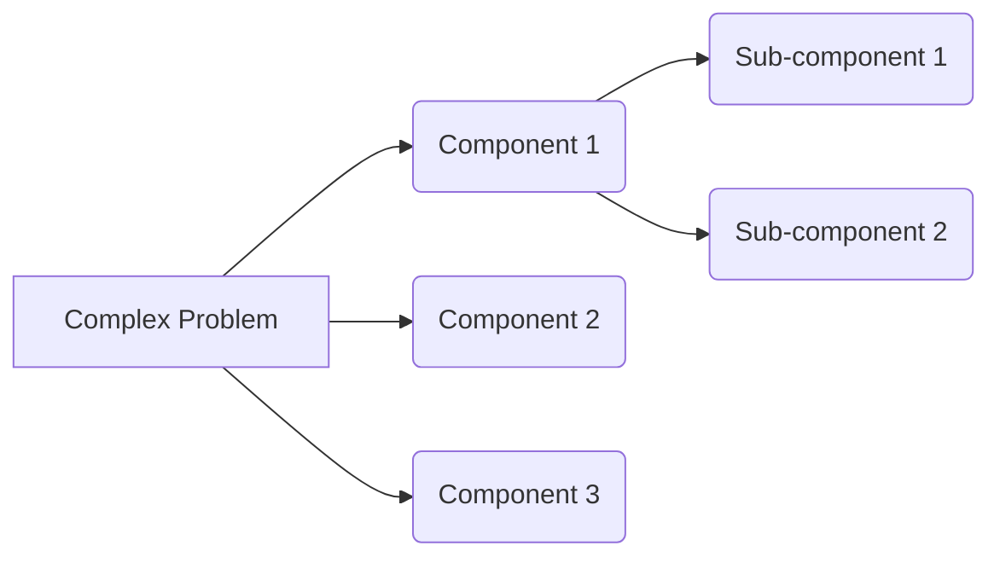

Okay, let's break down the important points to consider with decomposition! It's a crucial skill in software engineering.

Here's a summary:

*   **Purpose:** Remember, decomposition is about breaking down a complex problem into smaller, manageable parts (as mentioned in the \"Decomposition\" section).

*   **Timing:** Don't decompose too early! Understand the overall requirements first. Premature decomposition can lead to unnecessary complexity (see \"Common Misunderstandings and Antipatterns\" in the Decomposition section).

*   **Complexity:** Avoid overly complex decompositions. A fine-grained decomposition can be problematic. Aim for a balance between simplicity and manageability.

*   **Dependencies:** Ensure well-defined interfaces and dependencies between components. Poorly managed dependencies lead to tight coupling.

*   **Responsibility:** Each component should have a clearly defined function and purpose.

Here's a simple diagram:

Think of it like this: you start with a big, scary problem (A) and break it down into smaller, more manageable pieces (B, C, D), and then potentially break those down even further (E, F).  Just be sure each piece has a clear job!

Keep these points in mind, and you'll be well on your way to effective decomposition. Let me know if you have more questions!
